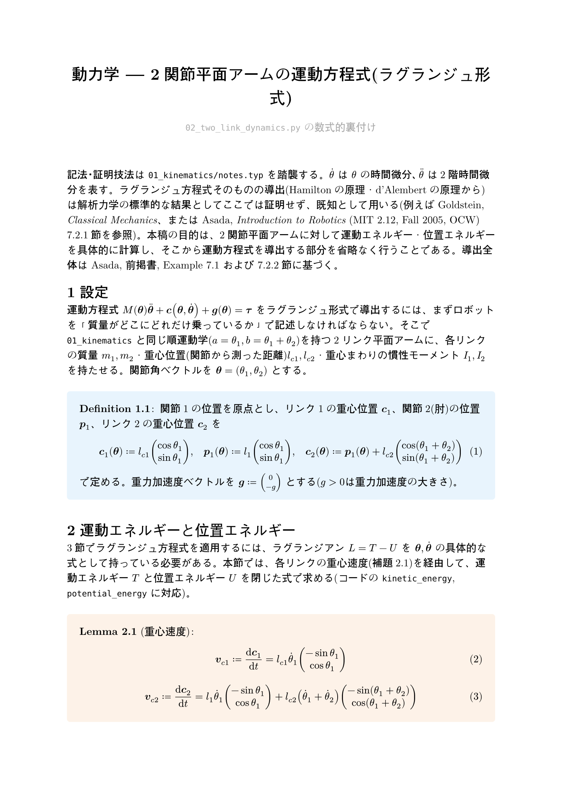
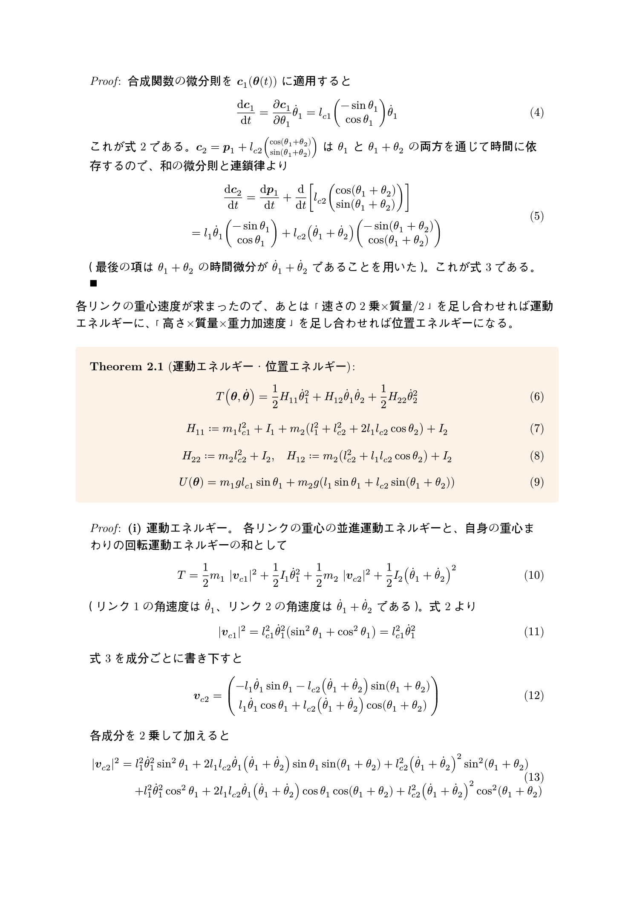
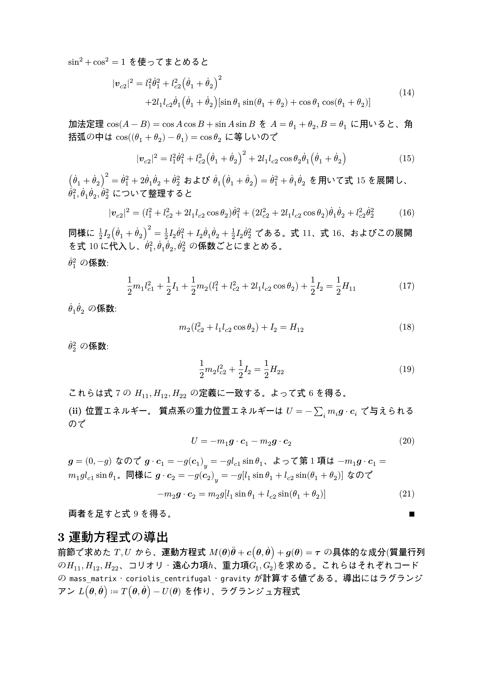
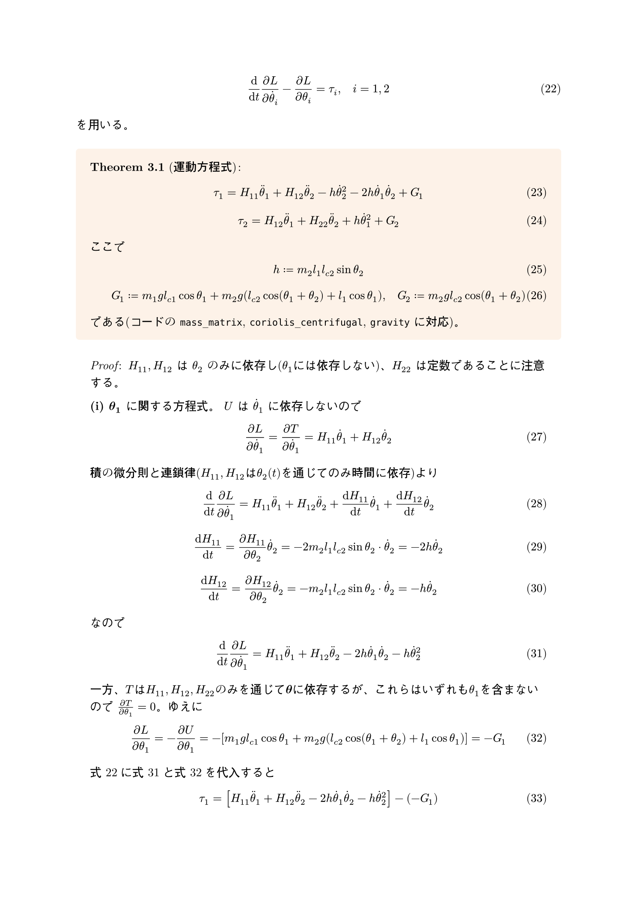
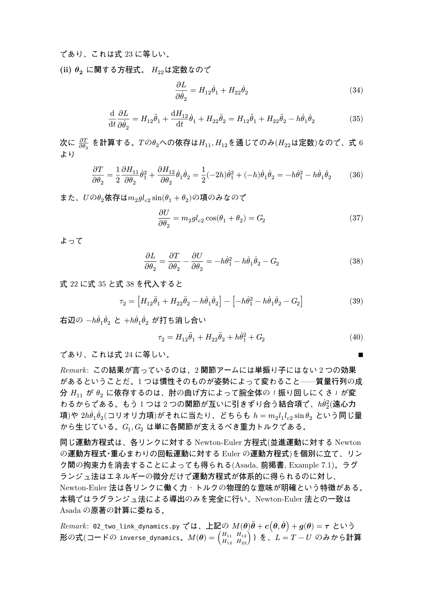

# 動力学 — 2関節平面アームの運動方程式(ラグランジュ形式)

`02_two_link_dynamics.py` の数式的裏付け。ソースは [`notes.typ`](notes.typ)（[`notes.pdf`](notes.pdf) にコンパイル済み）。このページはGitHub上でTypstをインストールせずに数式を読めるように、コンパイル結果をページ画像として埋め込んだものです。

`01_kinematics`と同じ2関節平面アームに質量・慣性を持たせ、各リンク重心の速度から運動エネルギー・位置エネルギーを導出し、ラグランジュ方程式を適用して運動方程式(慣性行列・遠心力/コリオリ力項・重力項)を行間を省略せずに導出しています(Asada, MIT 2.12 OCW 第7章に基づく)。

---

---

---

---

---

---

