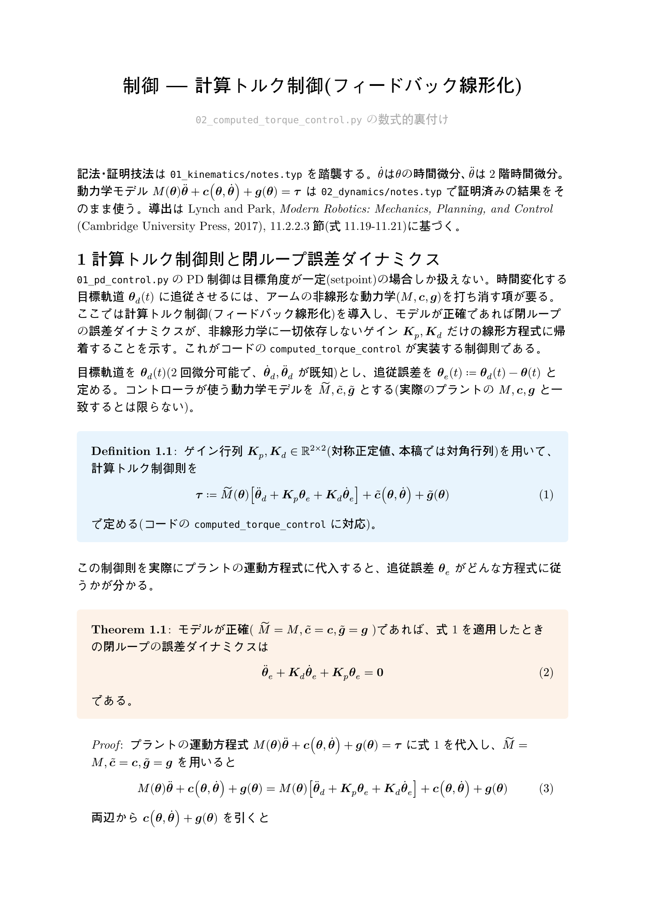
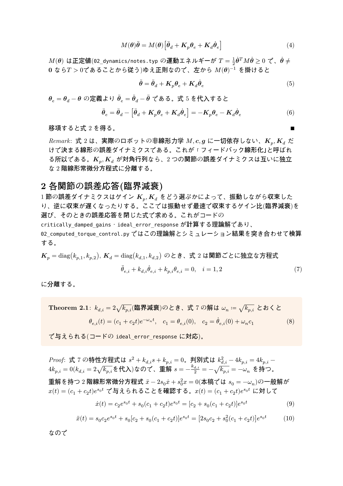
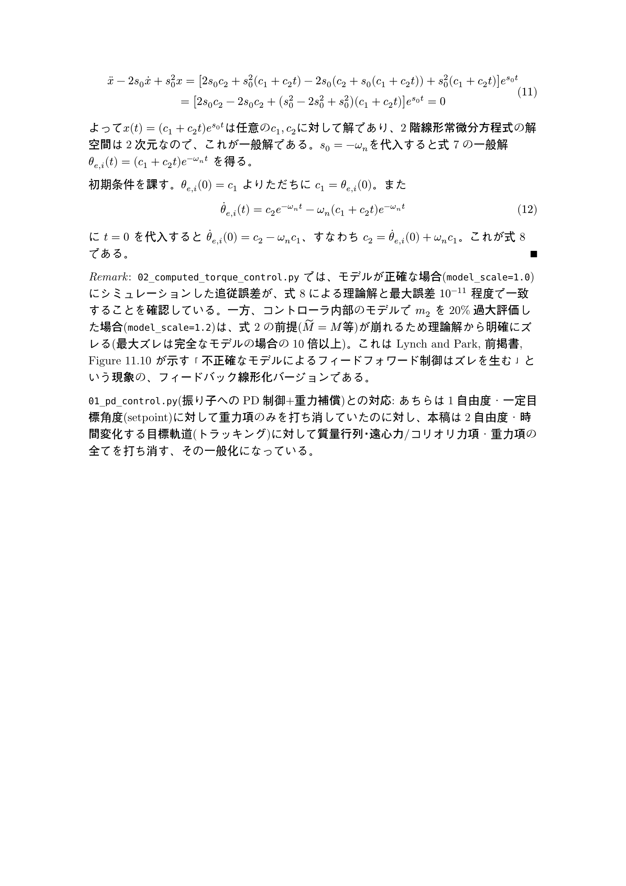

# 制御 — 計算トルク制御(フィードバック線形化)

`02_computed_torque_control.py` の数式的裏付け。ソースは [`notes.typ`](notes.typ)（[`notes.pdf`](notes.pdf) にコンパイル済み）。このページはGitHub上でTypstをインストールせずに数式を読めるように、コンパイル結果をページ画像として埋め込んだものです。

`02_dynamics`で証明済みの運動方程式を使って、計算トルク制御則が閉ループの誤差ダイナミクスを線形の臨界減衰系に帰着させることを証明し、その解を重解を持つ2階線形常微分方程式の一般解として導出しています(Lynch and Park, *Modern Robotics* 11.2.2.3節に基づく)。

---

---

---

