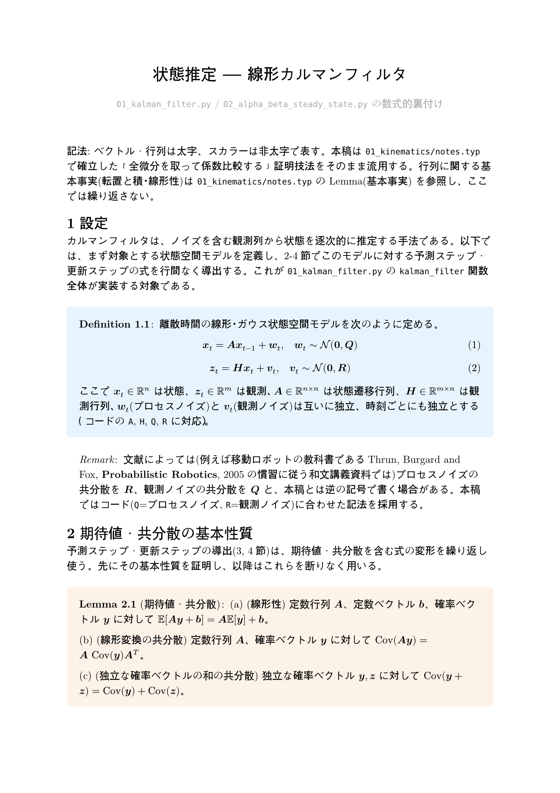
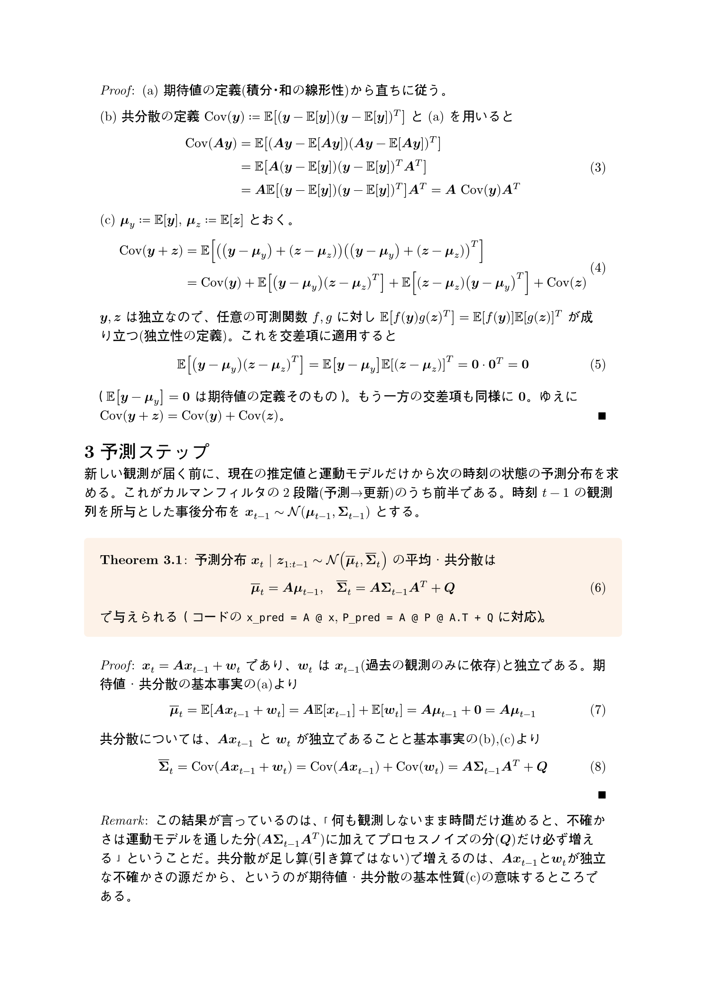
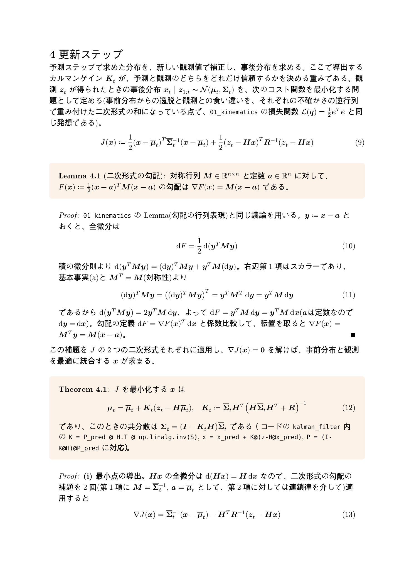
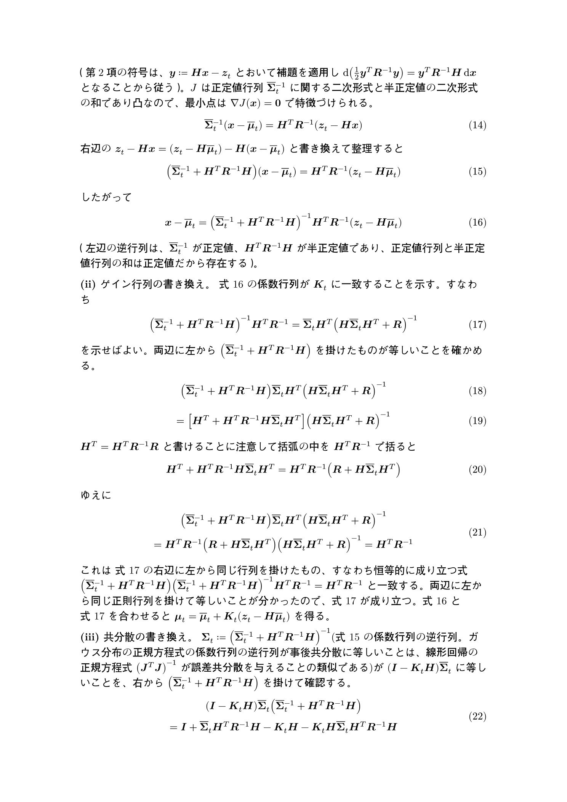
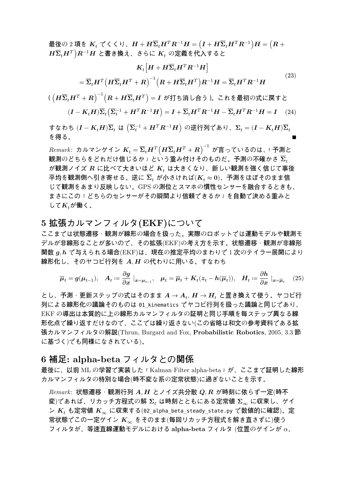

# 状態推定 — 線形カルマンフィルタ

`01_kalman_filter.py` / `02_alpha_beta_steady_state.py` の数式的裏付け。ソースは [`notes.typ`](notes.typ)（[`notes.pdf`](notes.pdf) にコンパイル済み）。このページはGitHub上でTypstをインストールせずに数式を読めるように、コンパイル結果をページ画像として埋め込んだものです。

期待値・共分散の基本性質から出発し、予測ステップ・更新ステップ(カルマンゲインの導出をコスト関数の最小化として行う)を行列形式で証明。EKFへの一般化、alpha-betaフィルタとの関係にも触れています。

---

---

---

---

---

---

