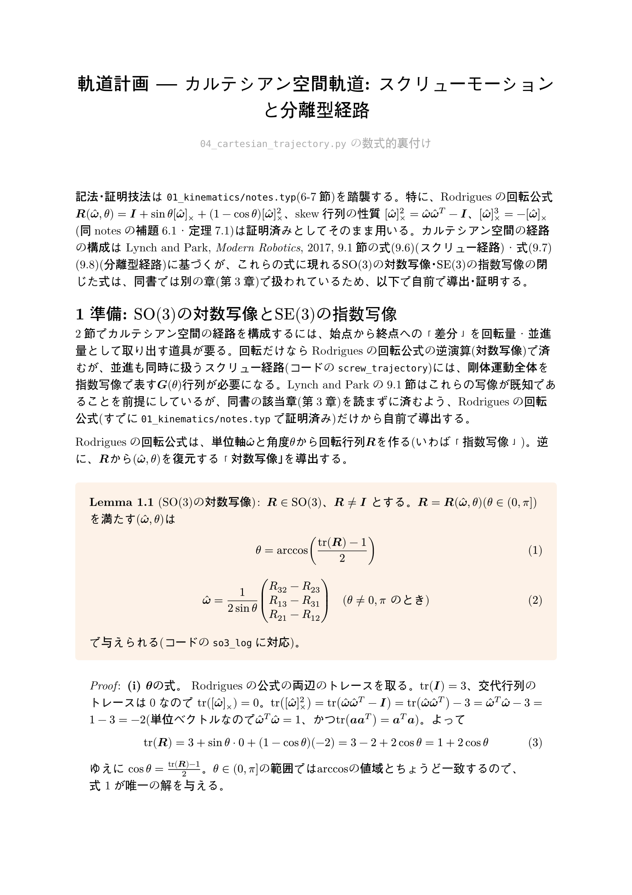
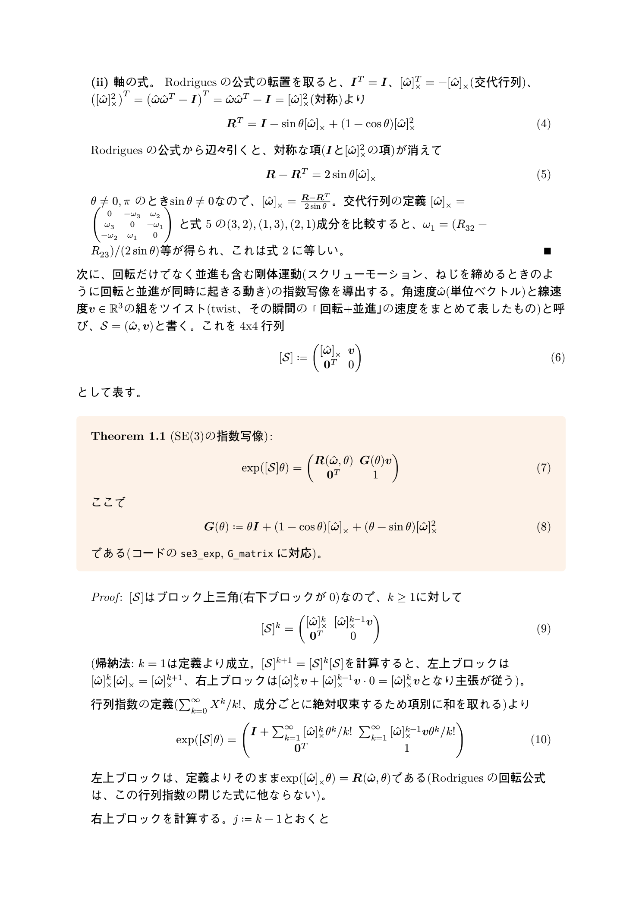
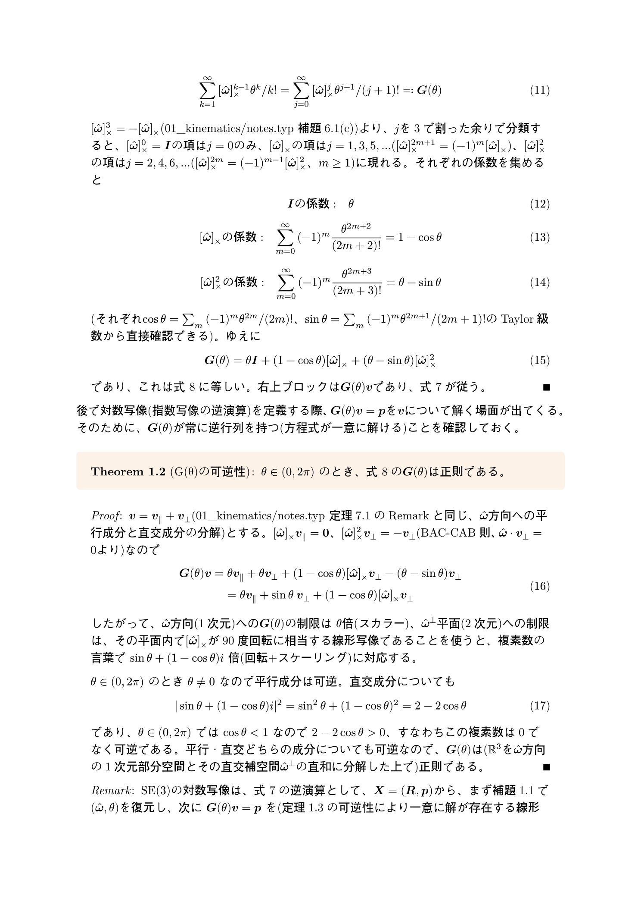
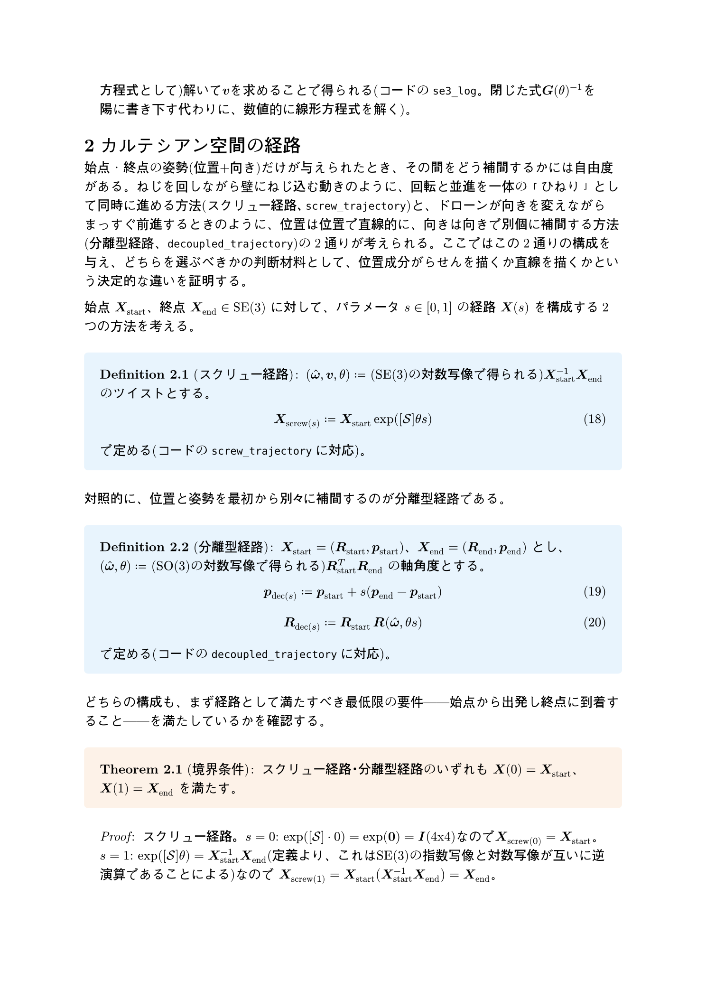
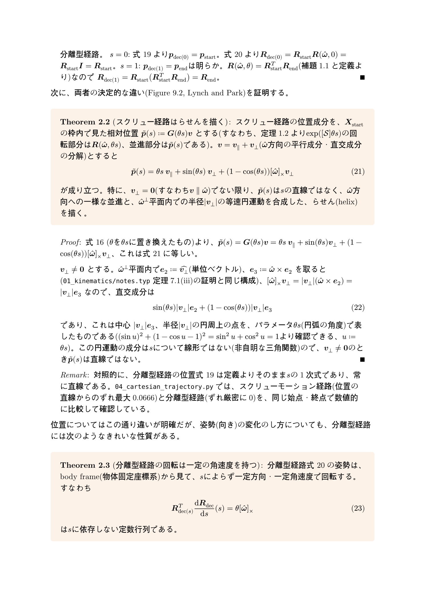
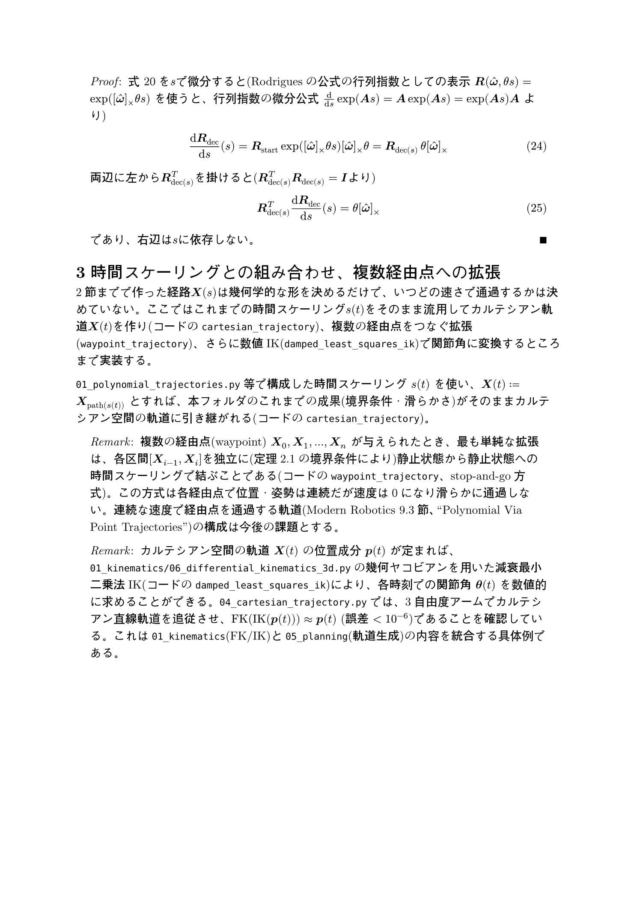

# 軌道計画 — カルテシアン空間軌道: スクリューモーションと分離型経路の証明

`04_cartesian_trajectory.py` の数式的裏付け。ソースは [`notes_cartesian.typ`](notes_cartesian.typ)（[`notes_cartesian.pdf`](notes_cartesian.pdf) にコンパイル済み）。このページはGitHub上でTypstをインストールせずに数式を読めるように、コンパイル結果をページ画像として埋め込んだものです。

`01_kinematics/notes.typ`で証明済みのRodriguesの回転公式・skew行列の性質を土台に、まず`SO(3)`の対数写像(回転行列から軸角度を復元する式)、次に`SE(3)`の指数写像(スクリューモーションの閉じた式、`G(θ)`行列とその可逆性)を自前で導出します(Lynch and Park, *Modern Robotics* 9.1節が使うこれらの式は同書の別の章に委ねられているため)。これらを使って、カルテシアン空間の2つの経路構成(スクリュー経路・分離型経路)を定義し、境界条件を満たすことを証明した上で、スクリュー経路の位置成分が一般に**らせん**を描くこと、分離型経路の姿勢がbody frameから見て一定角速度で回転することを証明します。

---

---

---

---

---

---

